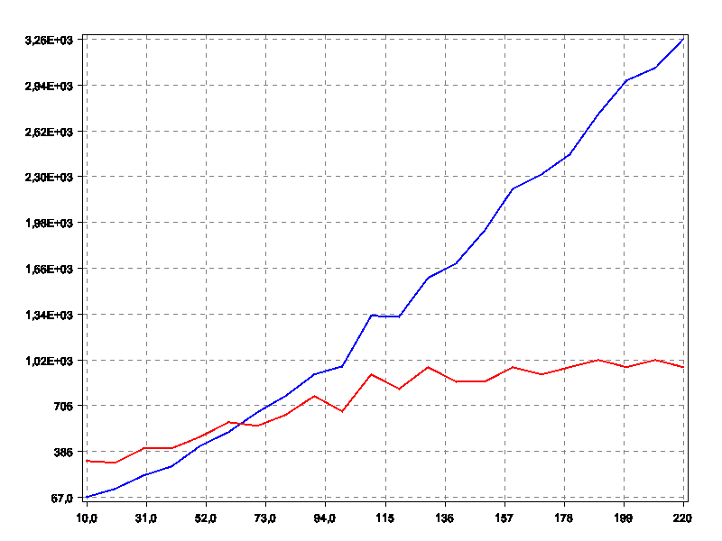

# Testaus
## Funktionaalinen testaus
Monte carlon algoritmia testataan suorittamalla algoritmi eri määrällä iteraatioita ja graafisesti tutkitaan
miten iteraatioiden lisääminen vaikuttaa tulokseen ja suoritusaikaa. Tulosta verrataan algoritmiin joka tekee päätöksen satunnaisesti.

Funktionaaliset testit ajetaan komennolla `mvn install -Pslow-tests`    
## Yksikkötestaus
Testataan kaikki luokan metodit erilaisilla syötteillä, rajattuna hyviin tapauksiin.

# Monte carlo 

Ajamalla monte carlo algoritmia huomataan, että noin 100 iteraation jälkeen lopputulos ei parane, mutta aikavaatimus
kasvaa lineaarisesti.

