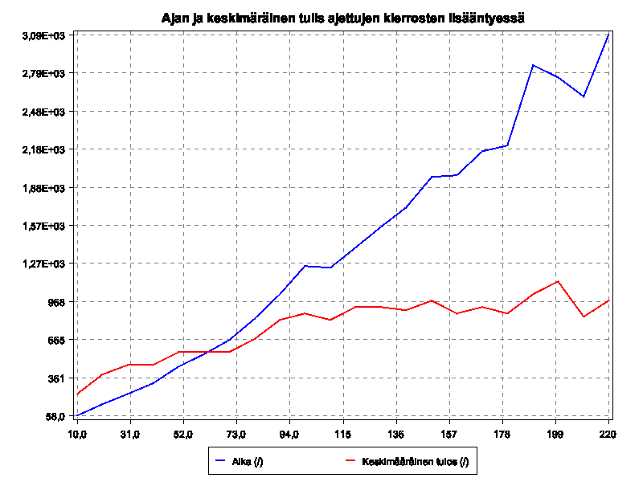
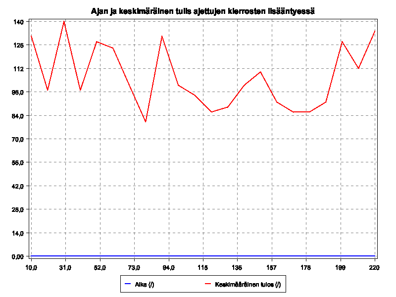

# Testaus
## Funktionaalinen testaus
Monte carlon algoritmia testataan suorittamalla algoritmi eri määrällä iteraatioita ja graafisesti tutkitaan
miten iteraatioiden lisääminen vaikuttaa tulokseen ja suoritusaikaa. Tulosta verrataan algoritmiin joka tekee päätöksen satunnaisesti.

Funktionaaliset testit ajetaan komennolla `mvn install -Pslow-tests`    
## Yksikkötestaus
Testataan kaikki luokan metodit erilaisilla syötteillä, rajattuna hyviin tapauksiin.

# Monte Carlon pelipuut

###Monte Carlo Pelipuut 20 -suoritusta 

|  Suorituskerta | Korkein |  Aika ms | Tulos  |
|---|---|---|---|
|  1 | 1024  |  1428 |  16832 |  
|  2 |  2048 |  1941 | 35900  |  
|  3 |  512 |  742 | 7204  |  
|  4 |  2048 | 1759  |  32244 |  
|  5 | 1024  |  1159 |  16248 |  
|  6 |  2048 |  1633 |  27188 |  
|  7 |  1024 | 1141  | 16360  |   
|  8 | 1024  |  1255 |  16192 |  
|  9 | 1024  |  1166 |  17828 |   
|  10 | 2048  | 1919  | 35792  |  
|  keskiarvo | 1382  | 1414  | 22178  |  

### Monte Carlo Pelipuut 100 -suoritusta 

|  Suorituskerta | Korkein |  Aika ms | Tulos  |
|---|---|---|---|
|  1 | 2048  |  10658 |  36452 |  
|  2 |  2048 |  9442 | 32300  |  
|  3 |  4096 |  9927 | 44492  |  
|  8 | 1024  |  6753 |  16088 |  
|  4 |  2048 | 10514  |  34388 |  
|  5 | 2048  |  10892 |  35796 |  
|  6 |  2048 |  9797 |  36128 |  
|  7 |  512 | 4081  | 7020  |   
|  9 | 1024  |  6515 |  16172 |   
|  10 | 2048  | 10640  | 36108  |  
|  keskiarvo | 8921  | 8921  | 29494  |  

### Monte Carlo Pelipuut 600 -suoritusta 

|  Suorituskerta | Korkein |  Aika ms | Tulos  |
|---|---|---|---|
|  1 |  2048 | 62535  | 36536  |  
|  2 |  2048 | 63612  | 36396  |  
|  3 |  2048 | 66020  |  36244 |  
|  8 |  2048 |  65498 | 36224  |  
|  4 |  1024 |  40472 |  15888 |  
|  5 |  2048 |  71600 | 36284  |  
|  6 |  4096 | 65913  | 44492  |  
|  7 | 2048  | 66538  | 36288  |   
|  9 |  2048 |  68339 |  36508 |   
|  10 |  4096 |  66044 | 44428  |  
|  keskiarvo | 2355  | 63657  | 35928  |  

# Monte carlo 

Ajamalla monte carlo algoritmia huomataan, että noin 100 iteraation jälkeen lopputulos ei parane, mutta aikavaatimus
kasvaa lineaarisesti.

# Monte Carlon pelipuut

# Random bot

Random bot suoriutuu vakioajassa ja tulokset pysyvät alhaisina, kuten kuvasta huomataan.

# Yhteenveto

Random bot pääsee parhaimmillaan noin `83%` monte-carlo botin tuloksesta, kun monte-carlia suoritetaan 10-iteraation 
parametrilla.  
